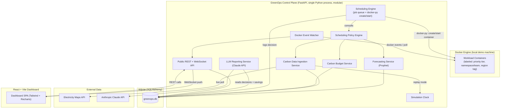

# 03 — System Architecture

## 1. High-Level Diagram



## 2. Components

### 2.1 Docker Engine (local demo machine)
- Real Docker daemon on the demo machine. Workload containers are simple, fast-running images (e.g. a small Python/alpine script that sleeps briefly then exits, or a real toy batch task) — the point is that they are genuinely created and executed, not mocked.
- Each container is launched with labels/env vars: `greenops.priority_tier`, `greenops.namespace` (team), `greenops.region` — the region tag is logical (see `02_Technical_Design.md §3.3`), used purely to select which carbon signal governs the job, since all containers physically run on one machine.

### 2.2 Scheduling Engine
- Owns an in-memory + DB-backed job queue. On every scheduling tick (driven by the Simulation Clock, not wall-clock — see §2.9), it evaluates all pending jobs against the Policy Engine.
- `critical` tier: engine creates/starts the container immediately on submission, unconditionally. This is a hard invariant, tested explicitly (`02_Technical_Design.md §5`).
- `standard`/`flexible` tier: engine only calls `docker-py`'s create/start when the Policy Engine approves the job for the current tick (current region tag's carbon conditions + forecast + budget all considered); otherwise the job remains queued (genuinely not running — verifiable via `docker ps` showing no container for it) and is re-evaluated on the next tick. This is the deferral mechanism — no separate "fake pending" state needed, the container simply doesn't exist yet.

### 2.3 Scheduling Policy Engine
- Pure-Python decision function: `decide(job_metadata, current_carbon[region], forecast[region], budget_remaining[namespace]) -> {approve: bool, target_region, reason}`.
- Combines: current carbon intensity, forecast trend (is it about to get cleaner soon?), tier urgency (how close to deadline), and remaining carbon budget for the namespace.
- Fully unit-testable in isolation from Docker — critical since this is the core IP of the project and needs to be demo-safe.
- For `flexible`/`standard` jobs with more than one viable region, the engine also picks the *best* region tag (spatial dimension) in addition to the *when* (temporal dimension) — this dual axis is the project's core differentiator.

### 2.4 Carbon Data Ingestion Service
- Two modes, switchable at runtime:
  - **Live mode**: polls Electricity Maps API per configured zone on an interval (respecting free-tier rate limits).
  - **Replay mode** (via Simulation Clock): reads pre-fetched historical data from `DB`, played back at configurable speed (e.g. 60x = 24h replayed in 24 minutes).
- All fetched data (live or replayed) is persisted to `carbon_intensity_readings` for forecasting and audit.

### 2.5 Forecasting Service
- Trains a Prophet model per region on historical carbon intensity, retrained periodically (or once pre-demo + incrementally updated).
- Fallback: weighted moving average + daily seasonality regression if Prophet is unavailable/fails to converge (keeps a working forecast even under time pressure — see `06_AI_Module_Design.md`).
- Forecast horizon: next 24h, refreshed hourly (or per simulation-clock tick).

### 2.6 Carbon Budget Service
- Each namespace has a configured carbon budget (kg CO2/day, seeded via config for the demo).
- Tracks cumulative estimated emissions per namespace; exposes remaining budget to the Policy Engine (used to further restrict `flexible` tier scheduling once budget is low) and to the dashboard.

### 2.7 LLM Reporting Service
- On demand (or on a timer), gathers a structured summary of recent scheduling decisions + savings from `DB`, sends to Claude API with a fixed prompt template, returns a short natural-language sustainability report. See `06_AI_Module_Design.md` for the schema and prompt.

### 2.8 Docker Event Watcher
- Watches Docker events (container start/stop/exit) via `docker-py`'s event stream and feeds real container state transitions into the WebSocket stream — so the dashboard reflects ground truth from the Docker daemon, not just our own decision log. This is the "prove it's real" cross-check, equivalent to what a Kubernetes pod watcher would have offered.

### 2.9 Public API + WebSocket
- REST endpoints for dashboard reads (see `05_API_Specification.md`).
- WebSocket channel pushes: new carbon readings, new scheduling decisions, budget updates, forecast refreshes, container state changes — dashboard is real-time, not polling.

### 2.10 Simulation Clock
- A single service that all time-dependent components (ingestion, forecast refresh, budget reset, scheduling ticks) read from instead of wall-clock time.
- Modes: `realtime` (1x, live API) and `replay@Nx` (accelerated, cached data). Switchable via API for live demo control (e.g. a judge asks "what if this were 3am" — flip to replay mode and jump the clock).

### 2.11 Frontend Dashboard
- React (Vite) SPA; see `07_UI_UX_Design.md` for screens.
- Talks to backend via REST (initial load) + WebSocket (live updates).

## 3. Deployment Topology (demo machine)

```
Demo laptop
├── Docker Engine
│   └── Workload containers (created/destroyed live by the Scheduling Engine)
├── GreenOps backend (uvicorn, single process, all services as modules — not microservices, to minimize moving parts under demo pressure)
├── SQLite file (greenops.db)
└── Frontend (vite dev server or static build served by backend)
```

Deliberately a **single-process monolith** for the control plane (modules, not microservices) — the differentiation is in the scheduling/forecasting/policy logic, not in distributed-systems complexity we don't have time to debug live. Internal module boundaries are still clean (see `02_Technical_Design.md`) so this could be split into services later if desired.

## 4. Why This Is Still a Real, Non-Trivial Systems Project (not "just a queue")

- Containers are genuinely absent until the Policy Engine approves them — deferral is a structural property of the system (no container object exists), not a status flag on a fake record.
- The dual temporal + spatial decision axis (when *and* where) is materially more sophisticated than "run later," and is what most public carbon-aware scheduling examples don't attempt.
- The Docker Event Watcher gives judges an independent, live cross-check (`docker ps`/`docker logs`) against every claim the dashboard makes — nothing is only asserted by our own UI.
