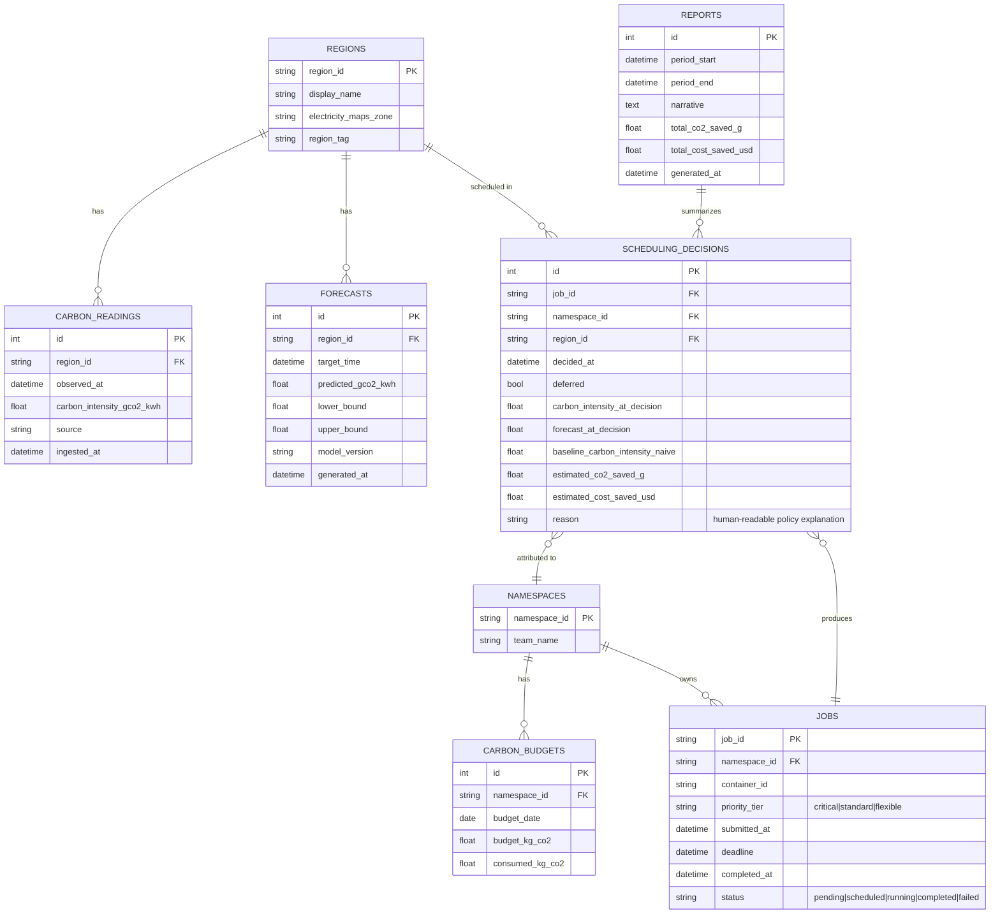

# 04 — Database Design

**Engine:** SQLite (via SQLAlchemy ORM). Chosen for zero-setup reliability on a demo machine; schema is written to be Postgres-portable if ever needed (no SQLite-specific types).

## 1. ER Diagram

## 2. Table Notes

- **REGIONS**: seeded at startup (3 rows for the demo), maps a logical region to both a real Electricity Maps zone code (for real data) and the `region_tag` attached to containers to simulate that region (see `02_Technical_Design.md §3.3`).
- **CARBON_READINGS**: append-only. Populated by the Ingestion Service in either live or replay mode; `source` distinguishes `live_api` vs `replay`. This table is the ground truth the Forecasting Service trains on.
- **FORECASTS**: one row per (region, target_time, model_version) — keeps forecast history so we can later compute forecast accuracy (predicted vs. actual `CARBON_READINGS`) for the MAPE metric in the PRD.
- **NAMESPACES**: proxy for "team" in the demo (no separate auth/user system — see `01_PRD.md §Out of scope`).
- **CARBON_BUDGETS**: one row per namespace per day; `consumed_kg_co2` incremented as `SCHEDULING_DECISIONS` complete; the Policy Engine reads `budget_kg_co2 - consumed_kg_co2` for `flexible` tier gating.
- **JOBS**: mirrors the job's lifecycle from submission through container completion; `container_id` is populated once the Scheduling Engine actually creates the Docker container, so the dashboard/demo can cross-reference `docker inspect <container_id>` against our own record — the "prove it's real" linkage.
- **SCHEDULING_DECISIONS**: the core audit log — one row every scheduling tick a job is evaluated (including "deferred, retry next tick"). `baseline_carbon_intensity_naive` records what a carbon-naive scheduler would have used (e.g. current intensity in the job's origin region with no deferral), enabling the savings calculation (`estimated_co2_saved_g`) used throughout the PRD's success metrics and the dashboard.
- **REPORTS**: one row per LLM-generated narrative report (see `06_AI_Module_Design.md`); stores the generated text plus the aggregate numbers it was grounded in, so the UI can display the number and the sentence together without recomputation.

## 3. Indexes

- `CARBON_READINGS(region_id, observed_at)` — time-range queries per region.
- `FORECASTS(region_id, target_time)` — forecast lookup for a given decision time.
- `SCHEDULING_DECISIONS(namespace_id, decided_at)` — budget burn-down and per-team reporting.
- `JOBS(status)` — dashboard's live job-state view.

## 4. Data Retention

Demo-scoped: no retention/archival policy needed. All tables can be reset via a single `scripts/seed.py` / `scripts/reset_demo.py` for repeatable rehearsal runs (see `08_Development_Plan.md`).
