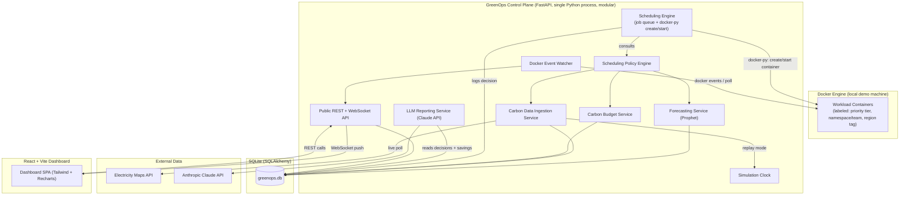

# 03. System architecture

## 1. High-level diagram



## 2. Components

### 2.1 Docker Engine (local demo machine)
The real Docker daemon runs on the demo machine. Workload containers are simple, fast-running images, for example a small Python or Alpine script that sleeps briefly then exits, or a real toy batch task. The point is that they are genuinely created and executed, not mocked.

Each container is launched with labels: `greenops.priority_tier`, `greenops.namespace` (team), `greenops.region`. The region tag is logical (see `02_Technical_Design.md §3.3`) and is used purely to select which carbon signal governs the job, since all containers physically run on one machine.

### 2.2 Scheduling Engine
This owns an in-memory and DB-backed job queue. On every scheduling tick, driven by the simulation clock rather than wall-clock time (see §2.10), it evaluates all pending jobs against the policy engine.

For `critical` tier jobs, the engine creates and starts the container immediately on submission, unconditionally. This is a hard invariant, tested explicitly (`02_Technical_Design.md §5`).

For `standard`/`flexible` tier jobs, the engine only calls `docker-py`'s create/start when the policy engine approves the job for the current tick, considering the current region tag's carbon conditions, forecast, and budget. Otherwise the job remains queued and genuinely not running, verifiable via `docker ps` showing no container for it, and is re-evaluated on the next tick. This is the deferral mechanism: no separate "fake pending" state is needed, because the container simply doesn't exist yet.

### 2.3 Scheduling Policy Engine
This is a pure Python decision function: `decide(job_metadata, current_carbon[region], forecast[region], budget_remaining[namespace]) -> {approve: bool, target_region, reason}`.

It combines current carbon intensity, forecast trend (is the region about to get cleaner soon?), tier urgency (how close to the deadline), and remaining carbon budget for the namespace. It's fully unit-testable in isolation from Docker, which matters because this is the core logic of the project and needs to be demo-safe.

For `flexible`/`standard` jobs with more than one viable region, the engine also picks the best region tag (the spatial dimension) in addition to timing (the temporal dimension). This dual axis is the project's main differentiator.

### 2.4 Carbon Data Ingestion Service
This has two modes, switchable at runtime. Live mode polls the Electricity Maps API per configured zone on an interval, respecting free-tier rate limits. Replay mode, driven by the simulation clock, reads pre-fetched historical data from the database and plays it back at a configurable speed, for example 60x meaning 24 hours replayed in 24 minutes.

All fetched data, live or replayed, is persisted to `carbon_intensity_readings` for forecasting and audit.

### 2.5 Forecasting Service
This trains a Prophet model per region on historical carbon intensity, retrained periodically, or once before the demo and incrementally updated after that.

The fallback is a weighted moving average with a daily seasonality regression, used if Prophet is unavailable or fails to converge, so there's a working forecast even under time pressure (see `06_AI_Module_Design.md`).

The forecast horizon is the next 24 hours, refreshed hourly or per simulation-clock tick.

### 2.6 Carbon Budget Service
Each namespace has a configured carbon budget in kg CO2 per day, seeded via config for the demo.

The service tracks cumulative estimated emissions per namespace and exposes remaining budget to both the policy engine (used to further restrict `flexible` tier scheduling once budget runs low) and the dashboard.

### 2.7 LLM Reporting Service
On demand, or on a timer, this gathers a structured summary of recent scheduling decisions and savings from the database, sends it to the Claude API with a fixed prompt template, and returns a short natural-language sustainability report. See `06_AI_Module_Design.md` for the schema and prompt.

### 2.8 Docker Event Watcher
This watches Docker events (container start/stop/exit) via `docker-py`'s event stream and feeds real container state transitions into the WebSocket stream, so the dashboard reflects ground truth from the Docker daemon rather than only our own decision log. It's the live cross-check that lets judges verify claims independently, equivalent to what a Kubernetes pod watcher would have offered.

### 2.9 Public API and WebSocket
REST endpoints handle dashboard reads (see `05_API_Specification.md`). A WebSocket channel pushes new carbon readings, new scheduling decisions, budget updates, forecast refreshes, and container state changes, so the dashboard is real-time rather than polling.

### 2.10 Simulation Clock
A single service that all time-dependent components (ingestion, forecast refresh, budget reset, scheduling ticks) read from instead of wall-clock time.

It has two modes: `realtime` (1x, live API) and `replay@Nx` (accelerated, cached data). It's switchable via the API for live demo control, for example if a judge asks "what if this were 3am," the presenter can flip to replay mode and jump the clock.

### 2.11 Frontend Dashboard
A React (Vite) single-page app; see `07_UI_UX_Design.md` for screens. It talks to the backend via REST for the initial load and WebSocket for live updates.

## 3. Deployment topology (demo machine)

```
Demo laptop
├── Docker Engine
│   └── Workload containers (created/destroyed live by the Scheduling Engine)
├── GreenOps backend (uvicorn, single process, all services as modules, not microservices)
├── SQLite file (greenops.db)
└── Frontend (vite dev server or static build served by backend)
```

The control plane is deliberately a single-process monolith made of modules, not microservices. The differentiation is in the scheduling, forecasting, and policy logic, not in distributed-systems complexity there's no time to debug live. Internal module boundaries are still clean (see `02_Technical_Design.md`), so this could be split into services later if desired.

## 4. Why this is a real systems project

Containers are genuinely absent until the policy engine approves them. Deferral is a structural property of the system (no container object exists), not a status flag on a fake record.

The dual temporal and spatial decision axis, when and where, is materially more sophisticated than "run later," and is something most public carbon-aware scheduling examples don't attempt.

The Docker Event Watcher gives judges an independent, live cross-check (`docker ps`/`docker logs`) against every claim the dashboard makes, so nothing is asserted only by the UI.
